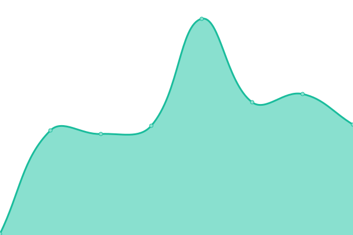

# [📈 Live Status](https://qupen.github.io/wirmag-uptime): <!--live status--> **🟩 All systems operational**

This repository contains the open-source uptime monitor and status page for [Patrik Wirheim](https://qupen.github.io/wirmag-uptime), powered by [Upptime](https://github.com/upptime/upptime).

With [Upptime](https://upptime.js.org), you can get your own unlimited and free uptime monitor and status page, powered entirely by a GitHub repository. We use [Issues](https://github.com/qupen/wirmag-uptime/issues) as incident reports, [Actions](https://github.com/qupen/wirmag-uptime/actions) as uptime monitors, and [Pages](https://qupen.github.io/wirmag-uptime) for the status page.

<!--start: status pages-->
<!-- This summary is generated by Upptime (https://github.com/upptime/upptime) -->
<!-- Do not edit this manually, your changes will be overwritten -->
<!-- prettier-ignore -->
| URL | Status | History | Response Time | Uptime |
| --- | ------ | ------- | ------------- | ------ |
|  [Landingpage](https://wirmag.se) | 🟩 Up | [landingpage.yml](https://github.com/qupen/wirmag-uptime/commits/HEAD/history/landingpage.yml) | 

 655ms
     
 | 

<a href="https://qupen.github.io/wirmag-uptime/history/landingpage">99.81%</a>
    

|  [Nextcloud](https://cloud.wirmag.se) | 🟩 Up | [nextcloud.yml](https://github.com/qupen/wirmag-uptime/commits/HEAD/history/nextcloud.yml) | 

 1282ms
     
 | 

<a href="https://qupen.github.io/wirmag-uptime/history/nextcloud">99.81%</a>
    

|  [Plex](https://lel.wirmag.se/web/index.html) | 🟩 Up | [plex.yml](https://github.com/qupen/wirmag-uptime/commits/HEAD/history/plex.yml) | 

 967ms
     
 | 

<a href="https://qupen.github.io/wirmag-uptime/history/plex">99.82%</a>
    

|  [google.com](https://www.google.com/) | 🟩 Up | [google-com.yml](https://github.com/qupen/wirmag-uptime/commits/HEAD/history/google-com.yml) | 

 98ms
     
 | 

<a href="https://qupen.github.io/wirmag-uptime/history/google-com">100.00%</a>
    

<!--end: status pages-->

[**Visit our status website →**](https://qupen.github.io/wirmag-uptime)

## 📄 License

- Powered by: [Upptime](https://github.com/upptime/upptime)
- Code: [MIT](./LICENSE) © [Anand Chowdhary](https://anandchowdhary.com), supported by [Pabio](https://pabio.com)
- Data in the `./history` directory: [Open Database License](https://opendatacommons.org/licenses/odbl/1-0/)
